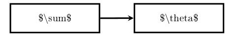
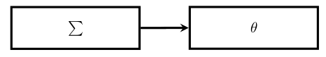

* Why Dia

  I try to find a simple flow chart tool under Ubuntu for taking notes. I have the following requirements:
  1. Simple
  2. Natively support LaTex formula
  3. Easy to use
  
  I have tried several options, such as Inkscape, LibreOffice Draw, and Dia. Inkscape is an excellent tool and I often
  use it for free drawing. It provides native support to LaTex formula. However, it isn't good at drawing flow chart,
  e.g. you can't creat auto connection between objects (let me know if you know how). Libreoffice Draw has an extention
  to support LaTex, but it is lack of features to create a little complicate chart. I end up with Dia for its easy-to-use
  features, high quality figures, and native support to LaTex.
  

* Install Dia

  ```
  sudo apt update
  sudo apt install dia
  ```

* Export Latex in Dia

  Menu File->Export and save as LaTex PGF *.tex file. 
  You can then include the Tex file to your LaTex file. If you use Emacs org-mode, you can do the following:
  ```
  #+LATEX_HEADER: \usepackage{tikz}
  #+LATEX_HEADER: \usepackage{adjustbox}

  #+BEGIN_LATEX
  \begin{adjustbox}{max width=\textwidth}
  \input{"/home/cgliu/figs/fixed/DoubleQ.tex"}
  \end{adjustbox}
  #+END_LATEX
  ```
  
* Latex formula in Dia

  I am now using dia 0.97+git, according to Dia help document, the LaTex formula should be enclosed between two '$'.
  When exporting to LaTex PGF or TikZ, Dia assumes that every special character you have inserted are supposed to be
  that way, and escapes the characters. So your math dollars will be escaped \$, your backslashes will be escaped
  \ensuremath{\backslash} and so on. So when you include the Tex, they don't show up as you expect, for example, it looks like. 

      

  I wrote a Python script to unescaped the special characters in PGF export. After this, it exported as expected, e.g.

      
  
  To use it, 
  ```
  >>> fix_formula.py <source_folder> 
  ```
